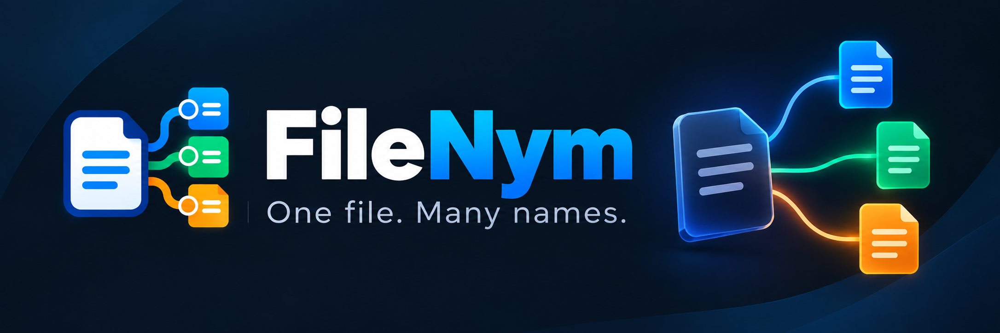

  

# filenym
One file. Many names. An open source contextual file identity project.

FileNym is an open source project exploring contextual file identities.

The idea is simple: one canonical file should be capable of being presented under different filenames depending on where or how it is used, without requiring the user to repeatedly rename or duplicate the original file.

## The Problem

A file may need different names in different contexts.

For example, you might keep a descriptive file on your computer:

`project-proposal-client-work-final.pdf`

But when using that same file in different contexts, you may want it to appear as:

`Project-Proposal.pdf`

`Client-Proposal.pdf`

`Software-Development-Proposal.pdf`

The content remains the same. Only the filename presented for that particular context changes.

FileNym is exploring a better approach.

## Core Principle

**One canonical file. Multiple contextual names.**

FileNym aims to avoid duplicating file contents when presenting a file under another name.

The original file should remain unchanged.

## Current Status

FileNym is currently in the **early research and architecture stage**.

We have intentionally not selected the underlying implementation yet.

We are investigating approaches including filesystem capabilities, operating system APIs, application level presentation, virtual filesystems, browser integration, and other mechanisms proposed by contributors.

The first technical question is:

> How can one physical file be reliably presented to another application under a different filename without duplicating its contents?

## Contributors Wanted

FileNym is currently in its research and architecture stage, and technical contributions are especially valuable.

We are looking for developers and researchers interested in:

- Filesystems and virtual filesystems
- Windows filesystem APIs
- Linux FUSE and macFUSE
- Browser file handling and extensions
- Native application integration
- Systems programming
- File identity, permissions, and security
- Cross-platform architecture

You do not need to implement the entire FileNym concept to contribute.

Small reproducible experiments, compatibility findings, technical references, architecture observations, and proof-of-concept work are all valuable.

### Where to Start

- Join the main architecture discussion in **GitHub Discussions**
- Review **RFC 0001: Contextual File Alias Mechanism**
- Explore issues labeled **`research`**
- Look for issues labeled **`good first issue`** if you want a smaller starting point

If you have experience with any relevant filesystem, operating system, browser, or native integration technology, we would especially value your perspective.

## Open Source

FileNym is being developed openly.

Developers, researchers, designers, security specialists, and anyone interested in file systems or developer tooling are welcome to contribute ideas, research, experiments, and code.

More documentation and contribution guidelines are coming soon.
